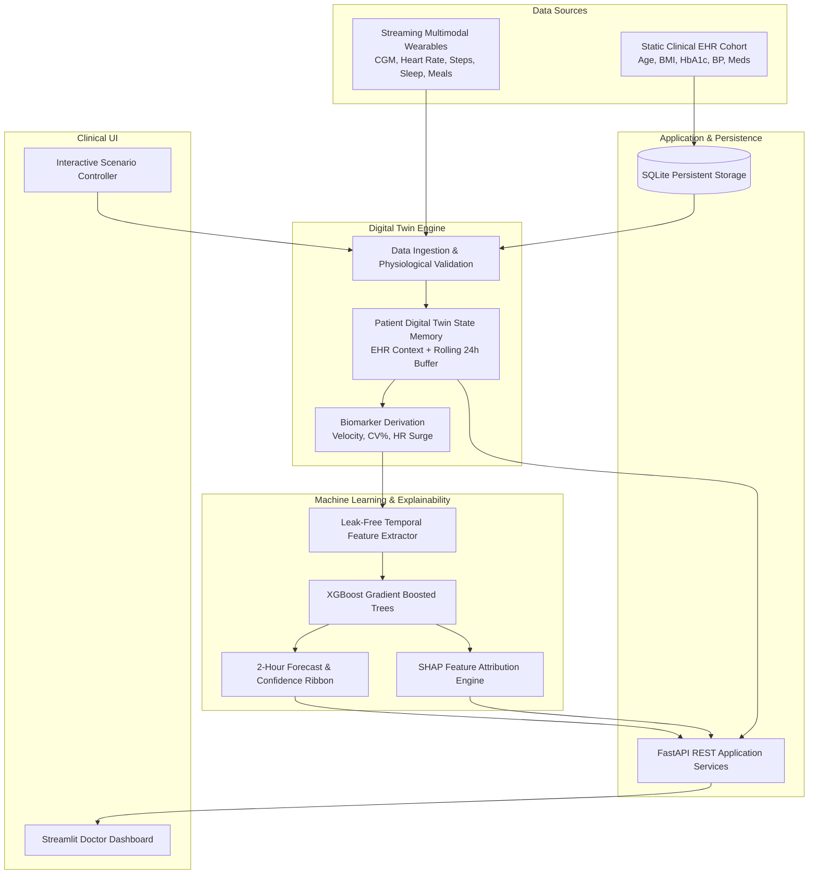

# System Architecture & Technical Specifications
### Healthcare Digital Twin for Type 2 Diabetes Glucose Spike Prediction
**Happiest Health Digital Twin Challenge 2026**

---

## 1. Architectural Philosophy: The Digital Twin Loop

Unlike conventional static clinical machine learning models, this system is architected as an **active physiological state loop**. The centerpiece of the system is the continuous synchronization between the external sensor telemetry and the virtual patient's internal physiological twin:

---

## 2. Decoupled Subsystem Layering

### 2.1 Data Layer (`src/data/`, `data/`)
- **Synthetic EHR Cohort**: Generates 100 Synthea-modeled virtual patient records.
- **Multimodal Wearable Stream**: Simulates continuous 15-minute sensor intervals capturing realistic coupled physiological dynamics (modified Bergman compartmental carbohydrate absorption, exercise GLUT4 translocation, circadian dawn phenomenon).
- **SQLite Database (`backend/database.py`)**: Stores static patient profiles, validated time-series telemetry, and historical prediction logs.

### 2.2 Digital Twin Layer (`src/digital_twin/`)
- **`ingestion.py`**: Validates incoming sensor data against strict human physiological bounds (glucose 20–600 mg/dL, HR 30–220 bpm) before state assimilation.
- **`twin_state.py` (`PatientTwinState`)**: Maintains the in-silico representation, including a rolling 24-hour buffer (96 ticks), instantaneous derived biomarkers (glucose velocity $\Delta G_{15}$, $\Delta G_{30}$, rolling standard deviation, %CV, and autonomic elevation).
- **`engine.py` (`DigitalTwinEngine`)**: Orchestrates the live cycle on each incoming sensor tick:
  $$\text{Tick} \rightarrow \text{Validate} \rightarrow \text{Update Buffer} \rightarrow \text{Derive State} \rightarrow \text{ML Inference} \rightarrow \text{SHAP} \rightarrow \text{Emit}$$

### 2.3 Machine Learning & Explainability Layer (`src/models/`, `src/features/`)
- **Temporal Feature Engineering**: Builds retrospective features $[t - w, t]$ guaranteeing zero future data leakage.
- **Trained Model Architecture**: Gradient Boosted Decision Trees (XGBoost) benchmarked against Random Forest and Logistic Regression baselines.
- **TreeSHAP Attribution**: Translates raw decision paths into clinician-interpretable risk drivers.

### 2.4 Application & API Layer (`backend/app.py`)
- FastAPI REST application serving endpoints:
  - `GET /patient/{id}`
  - `GET /patient/{id}/history`
  - `POST /sensor-data`
  - `GET /patient/{id}/current-state`
  - `GET /patient/{id}/prediction`
  - `GET /patient/{id}/risk-factors`
  - `POST /simulate`

### 2.5 Presentation Layer (`frontend/dashboard.py`)
- Clinical dashboard providing:
  - Real-time telemetry KPI tiles with directional velocity arrows.
  - Multi-trace Plotly chart showing historical CGM, target euglycemia, danger threshold, and 2-hour forward forecast ribbon.
  - Heart rate and step activity co-plots.
  - SHAP local risk driver attribution bar charts.
  - Interactive scenario simulator (Postprandial Surge vs Euglycemic Walk vs Dawn Phenomenon).

---

## 3. Data Privacy and Non-Diagnostic Declaration
- **Synthetic Guarantee**: All patient names, demographics, and sensor streams are 100% synthetically generated. No real patient data was used or stored.
- **Safety**: Designed solely as an educational and research proof-of-concept for the Happiest Health Challenge 2026.
